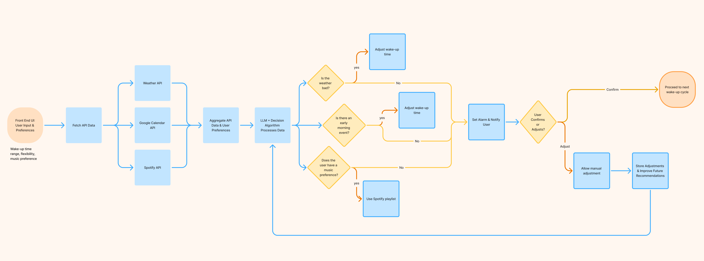

# Mornova AI

## 🚀 Overview
Mornova AI is a **personalized wake-up assistant** that combines **smart lighting, AI-driven scheduling, and music integration** to create a smooth, natural morning experience. Instead of harsh alarms, it gradually wakes you up using **adaptive light, sound, and real-time insights** like weather and schedule adjustments.

## 🛠️ System Diagram
The system follows a structured workflow where **user input, external data (weather, schedule, music), and AI-driven logic** determine the wake-up experience.

### 🔍 Understanding the Diagram
1. **User inputs preferences** → Preferences are stored in a database.
2. **APIs fetch data** → Retrieves weather conditions, schedule, and music choices.
3. **Processing & AI Analysis** → Adjusts wake-up time based on external factors.
4. **Wake-Up Time Adjustment** → Generates an optimized wake-up suggestion.
5. **User Feedback Loop** → Adjustments improve future recommendations.

For detailed pseudocode, see [`pseudocode.py`](pseudocode.py).

## 🌅 Key Features
- **Smart Light-Based Wake-Up** – Simulates sunrise with gradual brightness adjustments.
- **AI-Powered Adaptive Alarms** – Adjusts wake-up time based on weather and calendar events.
- **Spotify Integration** – Custom morning playlists and natural soundscapes.
- **Voice & Touch Interaction** – Control wake-up settings with voice commands or physical taps.
- **Night Mode** – Wind-down routines with dimmed lights and ambient sounds.

## 🏗️ Tech Stack
- **Backend:** Python (FastAPI/Flask)
- **AI & Logic:** Pre-trained LLMs (GPT-4), API calls for real-time data
- **APIs Used:**
  - Google Calendar (for scheduling insights)
  - OpenWeather API (for weather-based wake-up adjustments)
  - Spotify API (for personalized wake-up soundtracks)
- **Frontend:** React.js / Flutter (if building an app UI)
- **Hardware (Optional):** ESP32, Raspberry Pi (for physical lamp control)

## 💡 Credits

- A **Duor.fun** creation, designed and developed by @duorfan.
